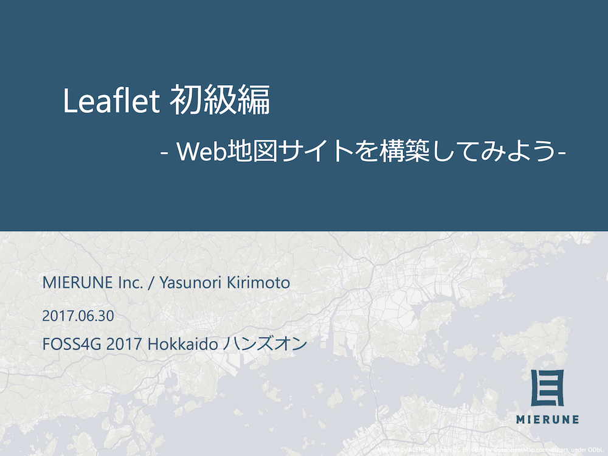
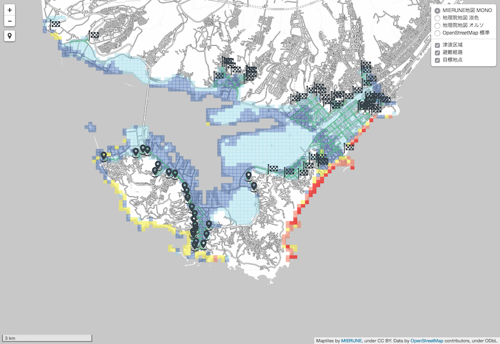

# FOSS4G 2017 Hokkaido ハンズオンデイ
## Leaflet初級編 - Web地図サイトを構築してみよう-

--- 

### スライド資料
<https://www.slideshare.net/dayjournal/leaflet-web-77401718>  

---

---

### 事前準備
<http://day-journal.com/blog/day-016>

---

### ハンズオン結果表示確認用URL
<http://day-journal.com/example/FOSS4G2017Hokkaido>

---

### データ内容
_resouceフォルダ  
> ハンズオン用データ一式  

Leaflet初級編_170630.pdf  
> スライド資料 PDF  

Leaflet初級編_テキスト.md  
> コピー用テキスト  

---

### 利用データ
- 室蘭市のオープンデータ(CC BY)

---

---

  
  